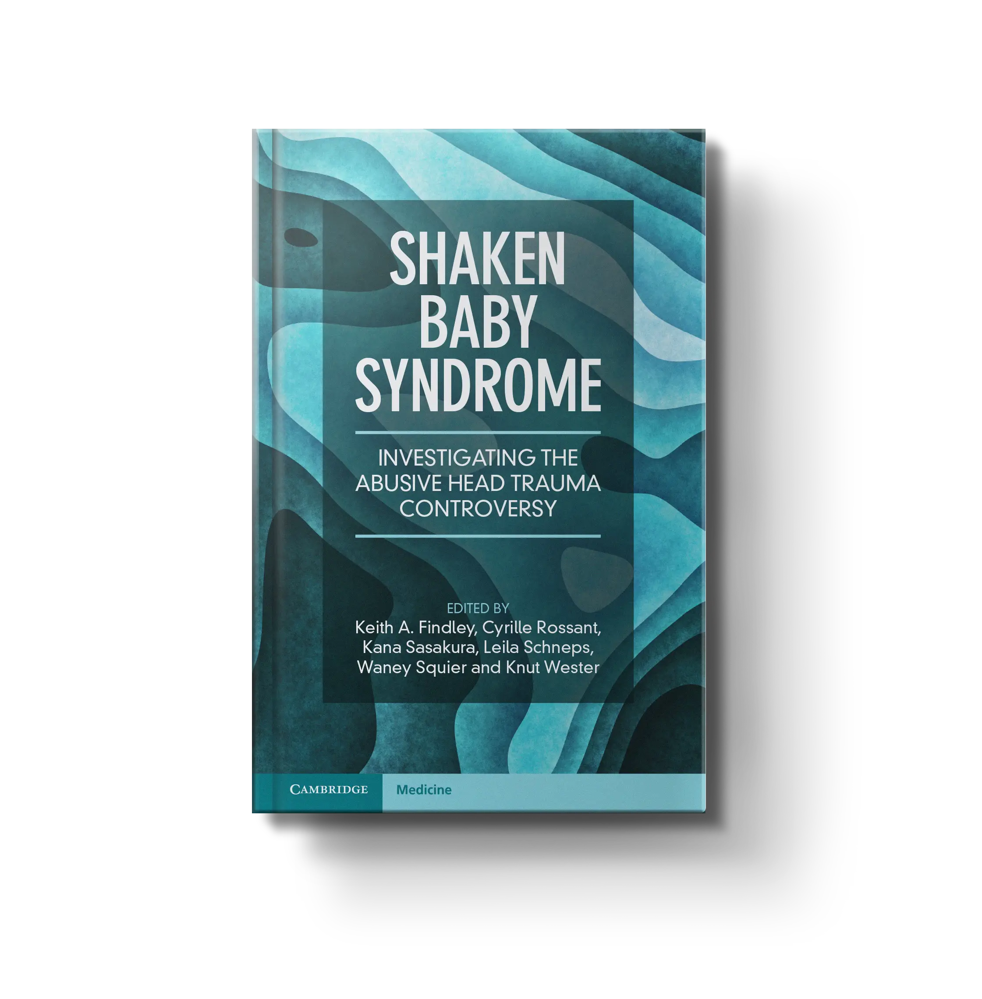

# Shaken Baby Syndrome: Investigating the Abusive Head Trauma Controversy

The first collaborative, multidisciplinary **academic textbook** to tackle the scientific reliability of medical determinations of **abusive head injuries** in infants, a highly controversial subject at the intersection of medicine, science, and law.

## Book info

* Publisher: [Cambridge University Press](https://www.cambridge.org/core/books/shaken-baby-syndrome/67016F1A1F6ED92141A179E9A5D145FB)
* Publication date: April 2023
* Online ISBN: 9781009177894

### Preorder

Hardcover copies will be available in UK stores in May 2023, and in US stores in July 2023.

Preorder now on:

* [**Cambridge University Press**](https://www.cambridge.org/core/books/shaken-baby-syndrome/67016F1A1F6ED92141A179E9A5D145FB) (available in April 2023)
* [**Waterstones**](https://www.waterstones.com/book/shaken-baby-syndrome/keith-a-findley/cyrille-rossant/9781009384766)
* [**Blackwell's**](https://blackwells.co.uk/bookshop/product/Shaken-Baby-Syndrome-by-Keith-Findley-editor/9781009384766)
* [**WHSmith**](https://www.whsmith.co.uk/products/shaken-baby-syndrome-investigating-the-abusive-head-trauma-controversy/keith-a-findley/cyrille-rossant/hardback/9781009384766.html)
* [**Barnes & Noble**](https://www.barnesandnoble.com/w/shaken-baby-syndrome-keith-a-findley/1143053792)
* [**Bookshop**](https://bookshop.org/p/books/shaken-baby-syndrome-investigating-the-abusive-head-trauma-controversy-leila-schneps/19790464?ean=9781009384766)
* [**Amazon UK**](https://www.amazon.co.uk/Shaken-Baby-Syndrome-Investigating-Controversy/dp/1009177885/) (available in April 2023)
* [**Amazon US**](https://www.amazon.com/Shaken-Baby-Syndrome-Investigating-Controversy/dp/1009384767) (available in April 2023)

## News

You'll find here the latest updates and errata about the book:

- 2023-02-19: initial README

## Co-editors

* [**Keith A. Findley**](https://secure.law.wisc.edu/profiles/kafindle), University of Wisconsin, Madison, US
* [**Cyrille Rossant**](https://cyrille.rossant.net/), University College London, UK
* [**Kana Sasakura**](https://researchers.adm.konan-u.ac.jp/html/90_en.html), Konan University, Japan
* [**Leila Schneps**](https://en.wikipedia.org/wiki/Leila_Schneps), Sorbonne Université, Paris, France
* [**Waney Squier**](https://en.wikipedia.org/wiki/Waney_Squier), formerly John Radcliffe Hospital, Oxford, UK
* [**Knut Wester**](https://www.uib.no/en/persons/Knut.Wester), Universitetet i Bergen, Norway

## Topic

For the past decades, a growing body of scientific studies in neuropathology, neurology, biomechanics, statistics, and psychology has cast doubt on the forensic reliability of medical determinations of Shaken Baby Syndrome (SBS), also known as Abusive Head Trauma (AHT). Studies have increasingly documented that the same findings are caused not only by non-accidental trauma, but also by accidental short falls and a wide range of medical conditions. Nevertheless, inaccurate diagnoses, unrealistic confidence expression, and wrongful convictions continue to this day.

Bringing together contributions from a multidisciplinary expert panel of 32 world-leading professionals, this landmark book explains the scientific evidence challenging the reliability of determinations of SBS/AHT and advances efforts to evaluate how deaths and serious brain injuries in infants should be analysed and investigated.

## Table of contents

| #   | Author                                       | Chapter                                                                                                                  |
| --- | -------------------------------------------- | ------------------------------------------------------------------------------------------------------------------------ |
|     | Barry Scheck                                 | Foreword                                                                                                                 |
| 1   | Chris Brook                                  | Maintaining the Orthodoxy and Silencing Dissent                                                                          |
| 2   | Randy Papetti                                | The History of SBS                                                                                                       |
|     |                                              | **MEDICINE**                                                                                                             |
| 3   | Waney Squier, Tommie Olofsson                | The neuropathology of SBS or retinodural haemorrhage of infancy                                                          |
| 4   | Julie Mack, Waney Squier                     | The importance of the correlation between radiology and pathology in SBS                                                 |
| 5   | Knut Wester, Johan Wikström                  | SBS, AHT – or just a type of hydrocephalus?                                                                              |
| 6   | Knut Wester, Johan Wikström, Joseph Scheller | SBS or benign external hydrocephalus - how is AHT depicted in the scientific literature?                                 |
| 7   | Marta Cohen                                  | Are some cases of sudden infant death syndrome incorrectly diagnosed as SBS?                                             |
| 8   | Bernard Echenne                              | AHT: the importance of predisposing factors                                                                              |
| 9   | Marvin Miller                                | How I Became a SBS Skeptic Paediatrician                                                                                 |
|     |                                              | **SCIENCE**                                                                                                              |
| 10  | Niels Lynoe, Anders Eriksson                 | The Swedish systematic literature review on suspected traumatic shaking (SBS) and its aftermath                          |
| 11  | Deborah Davis, Richard Leo                   | Interrogation and the Infanticide Suspect: Mechanisms of Vulnerability to False Confession                               |
| 12  | Keith Findley                                | Can confession substitute for science in SBS/AHT?                                                                        |
| 13  | Jeff Kukucka, Keith Findley                  | Cognitive Bias in Medicolegal Judgments                                                                                  |
| 14  | Kirk Thibault                                | Biomechanical forensic analysis of shaking and short fall head injury mechanisms in infants and young children           |
| 15  | Leila Schneps                                | When lack of information leads to apparent paradoxes and wrong conclusions: analysis of a seminal article on short falls |
| 16  | Ulf Högberg                                  | Epidemiology of findings claimed to be highly specific for SBS/AHT, a prerequisite to improve diagnosis of child abuse   |
| 17  | Norman Fenton, Scott McLachlan               | SBS: Exploring concerns about the ‘triad’ diagnosis and its statistical validation using a causal Bayesian Network       |
|     |                                              | **LAW**                                                                                                                  |
| 18  | Felicity Goodyear-Smith                      | Mandatory reporting of child maltreatment                                                                                |
| 19  | Kathleen Pakes                               | SBS/AHT Opinion Evidence in U.S. Courts                                                                                  |
| 20  | Keith Findley                                | Undoing Wrongful Convictions: Exonerating the Innocent in SBS/AHT Cases                                                  |
|     |                                              | **INTERNATIONAL**                                                                                                        |
| 21  | Clive Stafford Smith                         | Ptolemy rather than Copernicus — The State of SBS In the British Legal System                                            |
| 22  | Cyrille Rossant, Grégoire Etrillard          | SBS in France                                                                                                            |
| 23  | Ulf Högberg, Goran Högberg                   | Sweden and SBS/AHT                                                                                                       |
| 24  | Kana Sasakura                                | SBS/AHT in Japan                                                                                                         |
| 25  | Chris Brook, Michael Nott                    | SBS in Australia                                                                                                         |
| 26  | Multiple authors                             | SBS around the world                                                                                                     |

## Errata

N/A

## References

* Many references can be found on [Cyrille Rossant's introduction to the SBS/AHT controversy](https://cyrille.rossant.net/introduction-shaken-baby-syndrome-controversy/).
