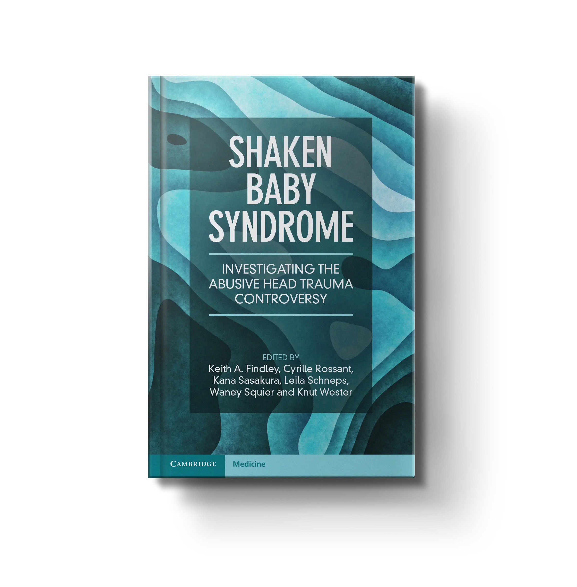

# Shaken Baby Syndrome: Investigating the Abusive Head Trauma Controversy

## Book info

* Publisher: [Cambridge University Press](https://www.cambridge.org/core/books/shaken-baby-syndrome/67016F1A1F6ED92141A179E9A5D145FB)
* Expected online publication date: March 2023
* Print publication year: 2023
* Online ISBN: 9781009177894

## News

- 2023/02/19: initial README

## Co-editors

* **Keith A. Findley**, University of Wisconsin, Madison, US
* **Cyrille Rossant**, University College London, UK
* **Kana Sasakura**, Konan University, Japan
* **Leila Schneps**, Sorbonne Université, Paris, France
* **Waney Squier**, John Radcliffe Hospital, Oxford, UK
* **Knut Wester**, Universitetet i Bergen, Norway

## Topic

Coming soon.

## Table of contents

Coming soon.

## Errata

N/A

## References

* Many references can be found on [Cyrille Rossant's introduction to the SBS/AHT controversy](https://cyrille.rossant.net/introduction-shaken-baby-syndrome-controversy/#sec-biblio).
